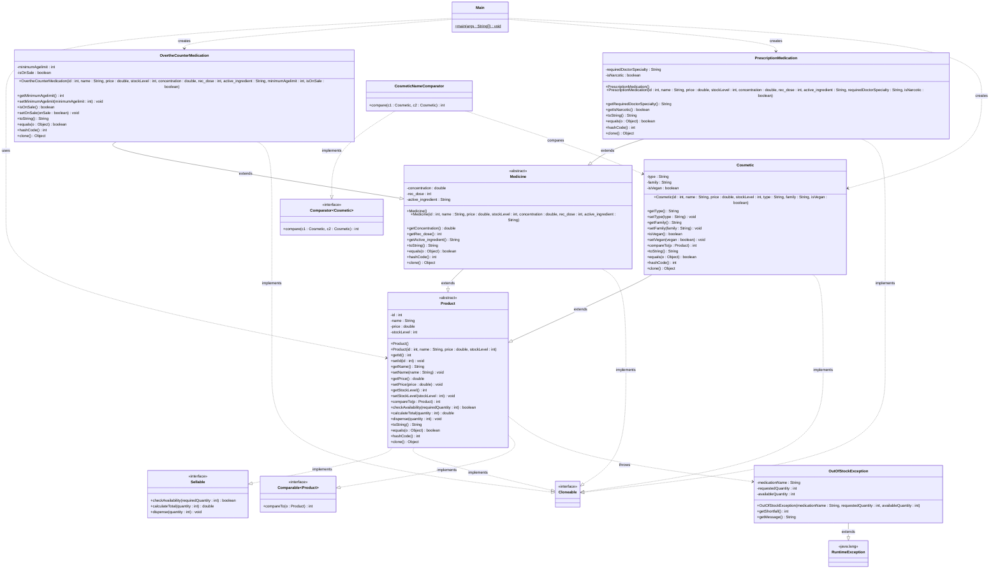

# PsTa – Pharmacy Management System

**Name:** Aly Hamad  
**Projekttitel:** Pharmacy Management System (Apotheken-Verwaltungssystem)

---

## Projektbeschreibung

Dieses Projekt ist ein objektorientiertes Apotheken-Verwaltungssystem, das in Java implementiert wurde. Es modelliert verschiedene Produkttypen einer Apotheke – darunter rezeptfreie Medikamente, verschreibungspflichtige Medikamente und Kosmetikprodukte – mithilfe einer Vererbungshierarchie mit abstrakten Klassen, Schnittstellen und Polymorphie.

### Projektidee

Das System ermöglicht die Verwaltung eines Apothekenbestands mit folgenden Funktionalitäten:
- Produkte erstellen, vergleichen und klonen
- Verfügbarkeit prüfen und Produkte ausgeben (dispensieren)
- Bestandsverwaltung mit automatischer Exception-Behandlung bei fehlendem Vorrat
- Sortierung von Produkten nach Preis (Comparable) und nach Name (Comparator)

---

## Anwendungsfall

Ein Apotheker möchte seinen Produktbestand verwalten. Er legt verschiedene Produkte an (z. B. Paracetamol als rezeptfreies Medikament, Amoxicillin als verschreibungspflichtiges Medikament, Feuchtigkeitscreme als Kosmetik). Das System ermöglicht es, die Verfügbarkeit zu prüfen, Produkte auszugeben und den Gesamtpreis für eine bestimmte Menge zu berechnen. Wenn ein Produkt nicht in ausreichender Menge vorrätig ist, wird eine `OutOfStockException` geworfen. Die Produkte können nach Preis oder alphabetisch sortiert werden.

---

## Technische Anforderungen – Zuordnung

| Anforderung | Klasse(n) / Datei(en) |
|---|---|
| **Vererbungsstruktur** | `Product` → `Medicine` → `PrescriptionMedication`, `OvertheCounterMedication`; `Product` → `Cosmetic` |
| **Abstrakte Klasse** | `Product` (abstract), `Medicine` (abstract) |
| **Schnittstelle (Interface)** | `Sellable` – implementiert von `Product` |
| **Polymorphie** | `Main.java` – `ArrayList<Product>` enthält verschiedene Unterklassen |
| **Exceptions** | `OutOfStockException` (extends `RuntimeException`) – verwendet in `Product.dispense()` |
| **Collection Framework** | `Main.java` – `ArrayList<Product>`, `Collections.sort()` |
| **Comparable** | `Product` implementiert `Comparable<Product>` (Vergleich nach Preis) |
| **Comparator** | `CosmeticNameComparator` implementiert `Comparator<Cosmetic>` (Vergleich nach Name) |
| **Object-Methoden** | `toString()`, `equals()`, `hashCode()`, `clone()` in allen Produktklassen |
| **Javadoc** | Alle Klassen und Methoden sind dokumentiert |
| **JUnit Tests** | `ProductTest`, `CosmeticTest`, `IntegrationTest` |

---

## UML Klassendiagramm



---

## Projektstruktur

```
src/
├── main/java/org/example/
│   ├── Product.java                  — Abstrakte Basisklasse für alle Produkte
│   ├── Sellable.java                 — Interface für verkäufliche Produkte
│   ├── Medicine.java                 — Abstrakte Klasse für Medikamente
│   ├── PrescriptionMedication.java   — Verschreibungspflichtige Medikamente
│   ├── OvertheCounterMedication.java — Rezeptfreie Medikamente
│   ├── Cosmetic.java                 — Kosmetikprodukte
│   ├── OutOfStockException.java      — Custom Exception bei fehlendem Vorrat
│   ├── CosmeticNameComparator.java   — Comparator für Sortierung nach Name
│   └── Main.java                     — Hauptprogramm mit Demonstrationen
└── test/java/org/example/
    ├── ProductTest.java              — JUnit Tests für Produkt-Funktionalität
    ├── CosmeticTest.java             — JUnit Tests für Kosmetik-Klasse
    └── IntegrationTest.java          — Integrations-Tests
```

---

## Build & Ausführung

```bash
# Build
./gradlew build

# Ausführen
./gradlew run

# Tests ausführen
./gradlew test
```
